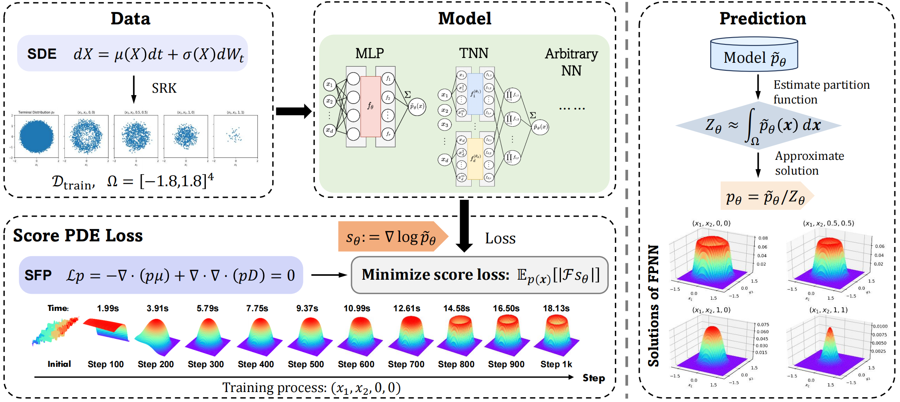
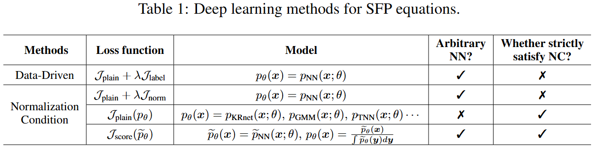
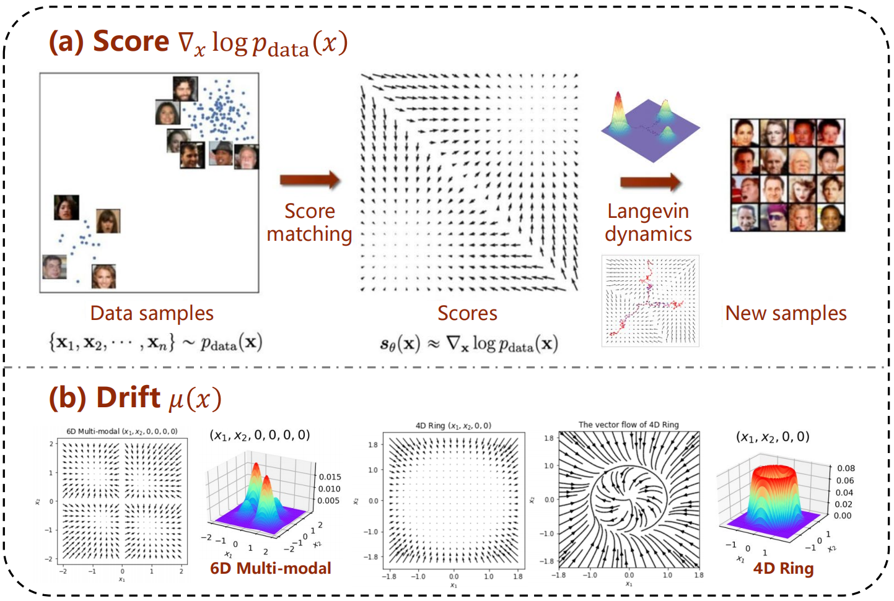
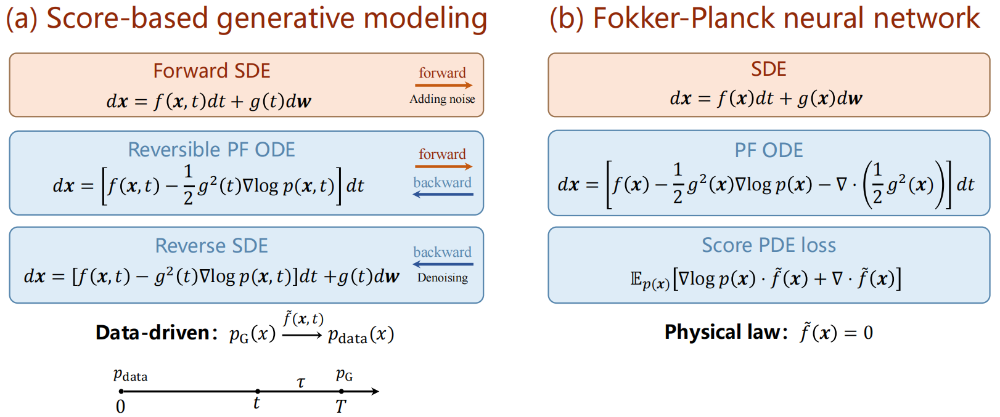

# Fokker-Planck neural network
FPNN has been accepted by [ICLR'25]([Score-based free-form architectures for high-dimensional Fokker-Planck equations|OpenReview](https://openreview.net/forum?id=5qg6JPSgCj)). For solving high-dimensional steady-state Fokker-Planck equations, FPNN adopts a score PDE loss to decouple the **score learning** and the **density normalization** into two stages. Our method allows free-form network architectures to model the **unnormalized density** and strictly satisfy normalization constraints by **post-processing**.

We summarize the tasks of image generation and SFP equations, and illustrate the connection between the score and the drift. We also provide a new perspective on **generative models** or training methods (score matching, flow matching and GAN) in Appendix A.4.

